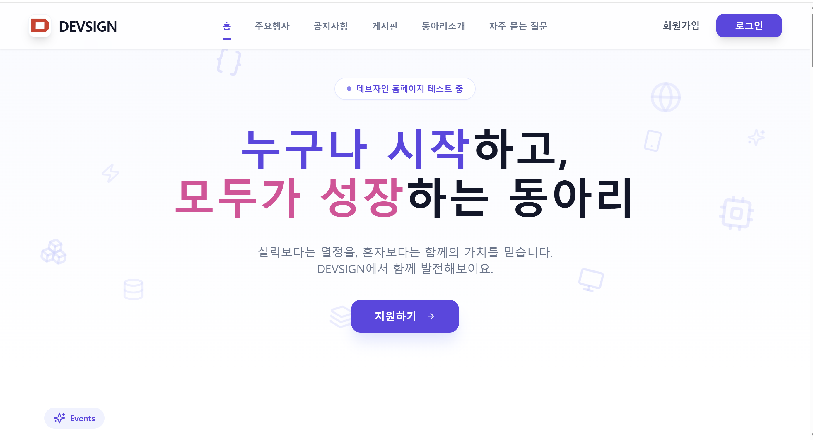

# DEVSIGN Website



## 1. 프로젝트 개요

**프로젝트 이름**: DEVSIGN Website

**프로젝트 설명**: DEVSIGN 동아리의 공식 웹사이트로 회원 관리, 공지사항/행사 공고, 게시판, 총회 자료 제출 시스템을 통합 관리하는 동아리 커뮤니티 플랫폼입니다.

**Visit** : [Devsign](https://devsign.co.kr/)

---

## 2. 팀원 및 역할

| 역할 | 이름   | 담당 업무                                                  | GitHub                                      |
| ---- | ------ | ---------------------------------------------------------- | ------------------------------------------- |
| 팀장 | 이성권 | 총괄, INFRA(Docker, Server), Project Scaffolding, 형상관리 | [GitHub](https://github.com/gwondev)        |
| 팀원 | 조용준 | INFRA, Reverse Proxy                                       | [GitHub](https://github.com/)               |
| 팀원 | 강형욱 | BACKEND, JWT 인증                                          | [GitHub](https://github.com/KANG-Hyeong-uk) |
| 팀원 | 정선아 | BACKEND, Database, ERD Design                              | [GitHub](https://github.com/SUN-AAA)        |
| 팀원 | 김민서 | FRONTEND, Figma Design, UI/UX                              | [GitHub](https://github.com/)               |
| 팀원 | 김형민 | FRONTEND, 회원가입/로그인, 게시판, CRUD                    | [GitHub](https://github.com/hmin112)        |

---

## 3. 주요 기능

### **회원 관리**

- 회원가입 및 로그인 (JWT 토큰 기반 인증)
- 디스코드 연동 인증
- 회원정보 수정 및 비밀번호 변경
- 회원 검색 및 상태 관리

### **공지사항**

- 공지사항 작성, 수정, 삭제
- 이미지 업로드 지원
- 공지 고정 기능
- 공지사항 상세 조회

### **행사 관리**

- 행사 포스터/이미지 업로드
- 행사 정보 CRUD
- 행사 조회 및 상세정보 확인
- 좋아요 기능

### **자유 게시판**

- 자유로운 주제의 게시물 작성
- 댓글 및 대댓글 기능
- 좋아요 기능
- 카테고리 분류 (회비, 일반 등)
- 이미지 업로드 지원

### **총회 (Assembly) 관리**

- 연도별, 학기별 총회 자료 제출
- PPT, PDF, 기타 파일 형식 지원
- 제출 현황 관리
- 다운로드 기능

### **관리자 기능**

- 회원 관리 (정지/복구/삭제)
- 접근 이력 로깅 및 조회
- 총회 설정 및 제출 현황 관리
- 공지사항/행사 관리
- Discord 연동 관리

### **Discord Bot**

- 자동 역할(Role) 할당
- Discord 서버 연동

---

## 4. 기술 스택

### Backend (Spring Boot)

| 분야                | 기술                     |
| ------------------- | ------------------------ |
| **Framework**       | Spring Boot 4.0.2        |
| **Language**        | Java 21                  |
| **Build Tool**      | Gradle                   |
| **Authentication**  | JWT (jjwt-0.12.3)        |
| **Security**        | Spring Security          |
| **Database**        | MySQL with JPA/Hibernate |
| **JSON Processing** | Jackson                  |
| **Utilities**       | Lombok                   |
| **Testing**         | JUnit 5, JUnit Platform  |

### Frontend (React + TypeScript)

| 분야                  | 기술                   |
| --------------------- | ---------------------- |
| **Framework**         | React 18.3.1           |
| **Language**          | TypeScript 5.6.2       |
| **Build Tool**        | Vite 6.0.5             |
| **Routing**           | React Router 7.13.0    |
| **Styling**           | Tailwind CSS 3.4.19    |
| **API Client**        | Axios 1.13.4           |
| **Component Library** | Radix UI               |
| **Icons**             | Lucide React           |
| **Animation**         | Motion (Framer Motion) |
| **CSS Utilities**     | clsx, tailwind-merge   |

### Infrastructure & DevOps

| 분야                        | 기술                            |
| --------------------------- | ------------------------------- |
| **Containerization**        | Docker                          |
| **Container Orchestration** | Docker-compose                  |
| **Database**                | MySQL (Latest)                  |
| **Web Server/Proxy**        | Caddy (Reverse Proxy with SSL)  |
| **Discord Bot**             | Python FastAPI                  |
| **Networking**              | Global Network (Docker compose) |

---

## 5. HOW TO RUN

### 사전 요구사항

- Docker & Docker-compose 설치
- Git 설치
- Node.js 18+ (로컬 개발시)
- Java 21 (로컬 개발시)

### 설치 및 실행 방법

#### **1단계: 프로젝트 클론**

```bash
git clone https://github.com/yourorg/devsign.git
cd devsign
```

#### **2단계: 환경 설정**

Discord Bot 환경 변수 파일 생성:

```bash
# Linux/Mac
touch /home/devsign/.env_devsign_bot

# Windows (PowerShell)
New-Item -Path "C:\devsign\.env_devsign_bot" -ItemType File
```

파일 내용 (예시):

```env
DISCORD_TOKEN=your_discord_token
DATABASE_URL=mysql://devsignuser:devsign4122@db:3306/devsigndb
BOT_BASE=http://discord-bot:8000
```

#### **3단계: Docker Compose로 실행**

```bash
# 모든 서비스 빌드 및 실행
docker-compose up -d

# 로그 확인
docker-compose logs -f

# 특정 서비스만 보기
docker-compose logs -f backend
docker-compose logs -f frontend
```

#### **4단계: 접속**

| 서비스         | URL                   | 포트              |
| -------------- | --------------------- | ----------------- |
| Frontend       | http://localhost      | 80                |
| Backend API    | http://localhost/api  | 80 (Caddy 프록시) |
| Backend Direct | http://localhost:8080 | 8080              |
| Discord Bot    | http://localhost:8000 | 8000              |
| MySQL          | localhost             | 3306              |

---

### 로컬 개발 환경 설정

#### **Backend 실행 (로컬)**

```bash
cd backend
./gradlew build
./gradlew bootRun
```

Backend는 포트 8080에서 실행됩니다.

#### **Frontend 실행 (로컬)**

```bash
cd frontend
npm install
npm run dev
```

Frontend는 기본적으로 `http://localhost:5173`에서 실행됩니다.

---

## 6. 프로젝트 구조

```
devsign/
│
├── backend/                           # Spring Boot 백엔드
│   ├── src/
│   │   ├── main/
│   │   │   ├── java/kr/co/devsign/    # 모든 Java 소스코드
│   │   │   │   ├── controller/        # REST API 컨트롤러 (Admin, Member, Board, Event, Notice, Assembly)
│   │   │   │   ├── service/           # 비즈니스 로직
│   │   │   │   ├── entity/            # JPA 엔티티 (DB 테이블 매핑)
│   │   │   │   ├── dto/               # 요청/응답 Data Transfer Object
│   │   │   │   ├── repository/        # JPA Repository (DB 조회)
│   │   │   │   ├── util/              # JWT, 파일 처리 등의 유틸리티
│   │   │   │   └── config/            # Spring Security, CORS 설정
│   │   │   └── resources/
│   │   │       └── application.properties  # Spring Boot 설정 (DB 연결, 포트 등)
│   │   └── test/                      # 테스트 코드
│   ├── gradle/                        # Gradle 빌드 도구
│   ├── Dockerfile                     # Docker 이미지 생성 설정
│   ├── build.gradle                   # Gradle 의존성 및 빌드 설정
│   └── gradlew, gradlew.bat           # Gradle 래퍼
│
├── frontend/                          # React + TypeScript 프론트엔드
│   ├── src/
│   │   ├── pages/                     # 라우팅 페이지 컴포넌트
│   │   │   ├── auth/                  # 로그인, 회원가입, 계정찾기
│   │   │   ├── home/                  # 메인 홈페이지
│   │   │   ├── profile/               # 사용자 프로필
│   │   │   ├── notice/                # 공지사항
│   │   │   ├── event/                 # 행사
│   │   │   ├── board/                 # 게시판
│   │   │   ├── assembly/              # 총회 자료 제출
│   │   │   └── admin/                 # 관리자 페이지
│   │   ├── components/                # 재사용 가능한 컴포넌트
│   │   │   ├── layout/                # Navbar, Footer 등 레이아웃
│   │   │   └── ui/                    # Button 등 UI 컴포넌트
│   │   ├── api/                       # Axios 설정 및 API 호출
│   │   ├── hooks/                     # 커스텀 React 훅
│   │   ├── store/                     # 상태 관리 (필요시)
│   │   ├── utils/                     # 유틸리티 함수
│   │   ├── App.tsx                    # 메인 앱 컴포넌트
│   │   ├── main.tsx                   # Entry Point
│   │   └── index.css, App.css         # 전역 스타일
│   ├── public/                        # 정적 자산 (이미지, 폰트 등)
│   │   └── images/                    # 프로젝트 이미지
│   ├── Dockerfile                     # Docker 이미지 생성 설정
│   ├── package.json                   # NPM 의존성
│   ├── vite.config.ts                 # Vite 빌드 설정
│   ├── tsconfig.json                  # TypeScript 설정
│   ├── tailwind.config.js             # Tailwind CSS 설정
│   └── eslint.config.js               # ESLint 설정
│
├── discord-bot/                       # Python FastAPI Discord Bot
│   ├── bot.py                         # 메인 Bot 로직
│   ├── requirements.txt               # Python 의존성
│   └── Dockerfile                     # Docker 설정
│
├── devsign-backend/                   # 빌드된 백엔드 아티팩트
│   ├── build/                         # 컴파일된 클래스 파일
│   └── resources/                     # 설정 파일
│
├── frontend_MINSEO/                   # 대체 UI/디자인 버전 (미사용)
│   ├── src/
│   ├── package.json
│   └── ...
│
├── uploads/                           # 사용자 업로드 파일 저장소
│   ├── posts/                         # 게시판 이미지
│   ├── notices/                       # 공지사항 이미지
│   ├── events/                        # 행사 포스터
│   └── assembly/                      # 총회 제출 파일
│
├── docker-compose.yml                 # Docker-compose 오케스트레이션 설정
├── Caddyfile                          # Caddy 웹 서버 설정 (Reverse Proxy)
├── .env_example                       # 환경 변수 예시
└── README.md                          # 프로젝트 문서

```

---

## 7. ERD (Entity-Relationship Diagram) 설계

.png)

---

## 8. API 문서

### API 엔드포인트 한눈에 보기

| 분류               | 메서드 | 경로                                            | 설명                   | 인증 |
| ------------------ | ------ | ----------------------------------------------- | ---------------------- | ---- |
| **Authentication** | POST   | `/api/members/signup`                           | 회원가입               | ❌   |
|                    | POST   | `/api/members/login`                            | 로그인                 | ❌   |
|                    | POST   | `/api/members/logout-log`                       | 로그아웃 로그 기록     | ✅   |
|                    | GET    | `/api/members/all`                              | 전체 회원 조회         | ❌   |
|                    | GET    | `/api/members/check/{loginId}`                  | 아이디 중복 확인       | ❌   |
|                    | PUT    | `/api/members/update/{loginId}`                 | 회원정보 수정          | ✅   |
|                    | PUT    | `/api/members/change-password/{loginId}`        | 비밀번호 변경          | ✅   |
| **Notice**         | GET    | `/api/notices`                                  | 공지사항 목록 조회     | ❌   |
|                    | POST   | `/api/notices`                                  | 공지사항 작성          | ✅   |
|                    | GET    | `/api/notices/{id}`                             | 공지사항 상세조회      | ❌   |
|                    | PUT    | `/api/notices/{id}`                             | 공지사항 수정          | ✅   |
|                    | DELETE | `/api/notices/{id}`                             | 공지사항 삭제          | ✅   |
|                    | PUT    | `/api/notices/{id}/pin`                         | 공지 고정 토글         | ✅   |
| **Event**          | GET    | `/api/events`                                   | 행사 목록 조회         | ❌   |
|                    | POST   | `/api/events`                                   | 행사 작성              | ✅   |
|                    | GET    | `/api/events/{id}`                              | 행사 상세조회          | ❌   |
|                    | PUT    | `/api/events/{id}`                              | 행사 수정              | ✅   |
|                    | DELETE | `/api/events/{id}`                              | 행사 삭제              | ✅   |
|                    | POST   | `/api/events/{id}/like`                         | 행사 좋아요 토글       | ✅   |
| **Board**          | GET    | `/api/posts`                                    | 게시물 목록 조회       | ❌   |
|                    | POST   | `/api/posts`                                    | 게시물 작성            | ✅   |
|                    | GET    | `/api/posts/{id}`                               | 게시물 상세조회        | ❌   |
|                    | PUT    | `/api/posts/{id}`                               | 게시물 수정            | ✅   |
|                    | DELETE | `/api/posts/{id}`                               | 게시물 삭제            | ✅   |
|                    | POST   | `/api/posts/{id}/like`                          | 게시물 좋아요 토글     | ✅   |
|                    | POST   | `/api/posts/{id}/comments`                      | 댓글 추가              | ✅   |
|                    | DELETE | `/api/posts/{postId}/comments/{commentId}`      | 댓글 삭제              | ✅   |
|                    | POST   | `/api/posts/{postId}/comments/{commentId}/like` | 댓글 좋아요 토글       | ✅   |
| **Assembly**       | GET    | `/api/assembly/my-submissions`                  | 나의 제출 현황 조회    | ❌   |
|                    | GET    | `/api/assembly/periods/{year}`                  | 제출 기간 조회         | ❌   |
|                    | GET    | `/api/assembly/download`                        | 파일 다운로드          | ❌   |
|                    | POST   | `/api/assembly/project-title`                   | 프로젝트 제목 저장     | ✅   |
|                    | POST   | `/api/assembly/submit`                          | 파일 제출              | ✅   |
| **Admin**          | GET    | `/api/admin/members`                            | 전체 회원 조회         | ✅   |
|                    | GET    | `/api/admin/members/deleted`                    | 탈퇴 회원 조회         | ✅   |
|                    | GET    | `/api/admin/logs`                               | 접근 이력 조회         | ✅   |
|                    | GET    | `/api/admin/settings`                           | Hero 설정 조회         | ✅   |
|                    | POST   | `/api/admin/settings`                           | Hero 설정 업데이트     | ✅   |
|                    | GET    | `/api/admin/periods/{year}`                     | 총회 기간 조회         | ✅   |
|                    | GET    | `/api/admin/periods/submissions`                | 제출된 회원 조회       | ✅   |
|                    | POST   | `/api/admin/periods/save-all`                   | 총회 기간 일괄 저장    | ✅   |
|                    | POST   | `/api/admin/periods/download-zip`               | 총회 자료 ZIP 다운로드 | ✅   |
|                    | GET    | `/api/admin/sync-discord`                       | Discord 동기화         | ✅   |
|                    | PUT    | `/api/admin/members/{id}/suspend`               | 회원 정지 토글         | ✅   |
|                    | POST   | `/api/admin/members/restore`                    | 회원 복구              | ✅   |
|                    | DELETE | `/api/admin/members/{id}`                       | 회원 삭제              | ✅   |
|                    | POST   | `/api/admin/verify-password`                    | 관리자 비밀번호 검증   | ✅   |

---

### **Authentication Endpoints**

#### **회원가입**

```
POST /api/members/signup
Content-Type: application/json

Request Body:
{
  "loginId": "string",
  "password": "string",
  "name": "string",
  "studentId": "string",
  "dept": "string",
  "interest": "string",
  "discordTag": "string"
}

Response: MemberResponse
{
  "id": "number",
  "loginId": "string",
  "name": "string",
  "studentId": "string",
  "dept": "string",
  "role": "USER|ADMIN",
  "userStatus": "ATTENDING|GRADUATED|SUSPENDED",
  ...
}
```

#### **로그인**

```
POST /api/members/login
Content-Type: application/json

Request Body:
{
  "loginId": "string",
  "password": "string"
}

Response: LoginResponse
{
  "status": "success|suspended|fail",
  "token": "JWT_TOKEN",
  "loginId": "string",
  "name": "string",
  "role": "USER|ADMIN",
  "userStatus": "ATTENDING|GRADUATED|SUSPENDED",
  ...
}
```

#### **로그아웃 로그 기록**

```
POST /api/members/logout-log
Content-Type: application/json

Request Body:
{
  "name": "string",
  "studentId": "string"
}

Response: StatusResponse
{
  "status": "success|fail",
  "message": "string"
}
```

#### **회원 정보 조회**

```
GET /api/members/all

Response: MemberResponse[]
```

#### **회원 정보 수정**

```
PUT /api/members/update/{loginId}
Content-Type: application/json
Query Parameters: authCode (디스코드 인증 코드)

Request Body: UpdateMemberRequest
{
  "dept": "string",
  "interest": "string",
  ...
}

Response: StatusResponse
```

#### **비밀번호 변경**

```
PUT /api/members/change-password/{loginId}
Content-Type: application/json

Request Body:
{
  "currentPassword": "string",
  "newPassword": "string"
}

Response: StatusResponse
```

#### **아이디 중복 확인**

```
GET /api/members/check/{loginId}

Response: boolean (true: 중복, false: 사용 가능)
```

---

### **Notice Endpoints (공지사항)**

#### **공지사항 목록 조회**

```
GET /api/notices

Response: NoticeResponse[]
{
  "id": "number",
  "title": "string",
  "content": "string",
  "author": "string",
  "createdAt": "datetime",
  "views": "number",
  "isPinned": "boolean",
  "images": "string[]",
  ...
}
```

#### **공지사항 작성**

```
POST /api/notices
Content-Type: multipart/form-data
Authorization: Bearer {token}

Form Fields:
- title: string
- content: string
- files: File[] (option)

Response: NoticeResponse
```

#### **공지사항 상세 조회**

```
GET /api/notices/{id}

Response: NoticeResponse (상세 정보 포함)
```

#### **공지사항 수정**

```
PUT /api/notices/{id}
Content-Type: multipart/form-data
Authorization: Bearer {token}

Form Fields:
- title: string
- content: string
- files: File[] (optional)

Response: NoticeResponse
```

#### **공지사항 삭제**

```
DELETE /api/notices/{id}
Authorization: Bearer {token}

Response: StatusResponse
```

#### **공지 고정 토글**

```
PUT /api/notices/{id}/pin
Authorization: Bearer {token}

Response: NoticePinResponse
{
  "id": "number",
  "isPinned": "boolean"
}
```

---

### **Event Endpoints (행사)**

#### **행사 목록 조회**

```
GET /api/events

Response: EventResponse[]
{
  "id": "number",
  "title": "string",
  "description": "string",
  "date": "datetime",
  "location": "string",
  "author": "string",
  "images": "string[]",
  "likes": "number",
  "createdAt": "datetime",
  ...
}
```

#### **행사 작성**

```
POST /api/events
Content-Type: multipart/form-data
Authorization: Bearer {token}

Form Fields:
- title: string
- description: string
- date: datetime
- location: string
- files: File[] (optional)

Response: EventResponse
```

#### **행사 상세 조회**

```
GET /api/events/{id}
Authorization: Bearer {token} (optional)

Response: EventDetailResponse
{
  ...EventResponse,
  "isLiked": "boolean" (현재 사용자가 좋아요 했는지 여부)
}
```

#### **행사 수정**

```
PUT /api/events/{id}
Content-Type: multipart/form-data
Authorization: Bearer {token}

Form Fields:
- title: string
- description: string
- date: datetime
- location: string
- files: File[] (optional)

Response: EventResponse
```

#### **행사 삭제**

```
DELETE /api/events/{id}
Authorization: Bearer {token}

Response: StatusResponse
```

#### **행사 좋아요 토글**

```
POST /api/events/{id}/like
Authorization: Bearer {token}

Response: EventLikeResponse
{
  "id": "number",
  "isLiked": "boolean",
  "likes": "number"
}
```

---

### **Board Endpoints (게시판)**

#### **게시물 목록 조회**

```
GET /api/posts

Response: PostResponse[]
{
  "id": "number",
  "title": "string",
  "content": "string",
  "category": "string",
  "author": "string",
  "views": "number",
  "likes": "number",
  "comments": "number",
  "images": "string[]",
  "createdAt": "datetime",
  ...
}
```

#### **게시물 작성**

```
POST /api/posts
Content-Type: multipart/form-data
Authorization: Bearer {token}

Form Fields:
- title: string
- content: string
- category: string (회비, 일반, 등)
- files: File[] (optional)

Response: PostResponse
```

#### **게시물 상세 조회**

```
GET /api/posts/{id}
Authorization: Bearer {token} (optional)

Response: PostResponse (상세 정보 및 댓글 포함)
{
  ...PostResponse,
  "isLiked": "boolean",
  "comments": [
    {
      "id": "number",
      "author": "string",
      "content": "string",
      "likes": "number",
      "createdAt": "datetime",
      "isLiked": "boolean"
    }
  ]
}
```

#### **게시물 수정**

```
PUT /api/posts/{id}
Content-Type: multipart/form-data
Authorization: Bearer {token}

Form Fields:
- title: string
- content: string
- category: string
- files: File[] (optional)

Response: PostResponse
```

#### **게시물 삭제**

```
DELETE /api/posts/{id}
Authorization: Bearer {token}

Response: StatusResponse
```

#### **게시물 좋아요 토글**

```
POST /api/posts/{id}/like
Authorization: Bearer {token}

Response: PostResponse (좋아요 수 업데이트)
```

#### **댓글 추가**

```
POST /api/posts/{id}/comments
Content-Type: application/json
Authorization: Bearer {token}

Request Body:
{
  "content": "string"
}

Response: PostResponse (댓글 추가됨)
```

#### **댓글 삭제**

```
DELETE /api/posts/{postId}/comments/{commentId}
Authorization: Bearer {token}

Response: PostResponse
```

#### **댓글 좋아요 토글**

```
POST /api/posts/{postId}/comments/{commentId}/like
Authorization: Bearer {token}

Response: PostResponse
```

---

### **Assembly Endpoints (총회)**

#### **나의 제출 현황 조회**

```
GET /api/assembly/my-submissions
Query Parameters:
- loginId: string
- year: number
- semester: number

Response: MySubmissionsResponse
{
  "year": "number",
  "semester": "number",
  "submissions": [
    {
      "reportId": "string",
      "projectTitle": "string",
      "presentationFile": "string",
      "pdfFile": "string",
      "otherFile": "string",
      "memo": "string",
      "submittedAt": "datetime"
    }
  ]
}
```

#### **제출 기간 조회**

```
GET /api/assembly/periods/{year}

Response: SubmissionPeriodResponse[]
{
  "year": "number",
  "semester": "number",
  "startDate": "datetime",
  "endDate": "datetime",
  "status": "OPEN|CLOSED"
}
```

#### **파일 다운로드**

```
GET /api/assembly/download
Query Parameters:
- path: string (파일 경로)

Response: File (binary)
```

#### **프로젝트 제목 저장**

```
POST /api/assembly/project-title
Content-Type: application/json
Authorization: Bearer {token}

Request Body:
{
  "loginId": "string",
  "year": "number",
  "semester": "number",
  "month": "number",
  "projectTitle": "string"
}

Response: StatusResponse
```

#### **파일 제출**

```
POST /api/assembly/submit
Content-Type: multipart/form-data
Authorization: Bearer {token}

Query Parameters:
- loginId: string
- reportId: string
- year: number
- semester: number
- month: number
- memo: string

Form Fields:
- presentation: File (optional - PPT/PDF)
- pdf: File (optional - PDF)
- other: File (optional - 기타)

Response: SubmitFilesResponse
{
  "status": "success|fail",
  "message": "string"
}
```

---

### **Admin Endpoints (관리자)**

#### **전체 회원 조회**

```
GET /api/admin/members
Authorization: Bearer {admin_token}

Response: AdminMemberResponse[]
```

#### **탈퇴 회원 조회**

```
GET /api/admin/members/deleted
Authorization: Bearer {admin_token}

Response: AdminMemberResponse[]
```

#### **접근 이력 조회**

```
GET /api/admin/logs
Authorization: Bearer {admin_token}

Response: AccessLogResponse[]
{
  "id": "number",
  "action": "string",
  "adminName": "string",
  "targetMemberId": "number",
  "ipAddress": "string",
  "timestamp": "datetime"
}
```

#### **Hero 섹션 설정 조회**

```
GET /api/admin/settings
Authorization: Bearer {admin_token}

Response: HeroSettingsResponse
```

#### **Hero 섹션 설정 업데이트**

```
POST /api/admin/settings
Content-Type: application/json
Authorization: Bearer {admin_token}

Request Body: HeroSettingsRequest

Response: StatusResponse
```

#### **총회 기간 조회**

```
GET /api/admin/periods/{year}
Authorization: Bearer {admin_token}

Response: AdminPeriodResponse[]
```

#### **제출된 회원 조회**

```
GET /api/admin/periods/submissions
Query Parameters:
- year: number
- semester: number
- month: number
Authorization: Bearer {admin_token}

Response: AdminPeriodSubmissionResponse[]
```

#### **총회 기간 일괄 저장**

```
POST /api/admin/periods/save-all
Content-Type: application/json
Authorization: Bearer {admin_token}

Request Body: AdminPeriodSaveRequest[]

Response: StatusResponse
```

#### **총회 자료 ZIP 다운로드**

```
POST /api/admin/periods/download-zip
Content-Type: application/json
Authorization: Bearer {admin_token}

Request Body: AdminPeriodZipRequest

Response: File (ZIP binary)
```

#### **Discord 동기화**

```
GET /api/admin/sync-discord
Authorization: Bearer {admin_token}

Response: SyncDiscordResponse
{
  "status": "success|fail",
  "syncedCount": "number"
}
```

#### **회원 정지 토글**

```
PUT /api/admin/members/{id}/suspend
Authorization: Bearer {admin_token}

Response: StatusResponse
```

#### **회원 복구**

```
POST /api/admin/members/restore
Content-Type: application/json
Authorization: Bearer {admin_token}

Request Body: RestoreMemberRequest

Response: StatusResponse
```

#### **회원 삭제**

```
DELETE /api/admin/members/{id}
Query Parameters:
- hard: boolean (true: 완전 삭제, false: 소프트 삭제)
Authorization: Bearer {admin_token}

Response: StatusResponse
```

#### **관리자 비밀번호 검증**

```
POST /api/admin/verify-password
Content-Type: application/json
Authorization: Bearer {admin_token}

Request Body:
{
  "password": "string"
}

Response: StatusResponse
```

---
